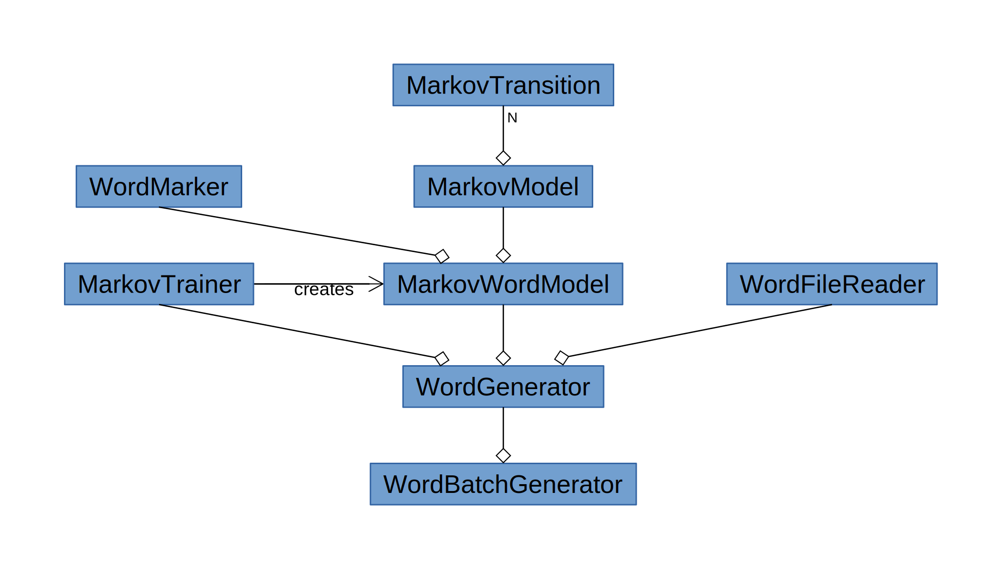

# cpp-markov-word-generator

Linux/UNIX command-line Markov Model word generator, written in C++.

[](https://github.com/digimokan/cpp-markov-word-generator/releases/latest "Latest Release Notes")
[](LICENSE.txt "Project License")
[](https://travis-ci.com/digimokan/cpp-markov-word-generator "Build And Test Results From Master Branch")

## Table Of Contents

* [Motivation](#motivation)
* [Features](#features)
* [Requirements](#requirements)
* [Quick Start](#quick-start)
* [Full Usage / Options](#full-usage--options)
* [Examples](#examples)
* [Design](#design)
* [Source Code Layout](#source-code-layout)
* [Contributing](#contributing)

## Motivation

Use machine learning / deep learning to generate words using a Markov Model.
Train the model with data sets of words.

## Features

* Efficient, modern C++ 17.
* Variable model order (number of hidden Markov models).

## Requirements

* A Linux/UNIX system
* C++ 17
* Boost (version 1.66.0 or higher)
* CMake
* Git

## Quick Start

1. Clone project into a local project directory:

   ```shell
   $ git clone https://github.com/digimokan/cpp-markov-word-generator.git
   ```

2. Change to the local project directory:

   ```shell
   $ cd cpp-markov-word-generator
   ```

3. Build the program:

   ```shell
   $ ./third_party/smart-build/src/smart-build.sh --build-type-release
   ```

4. Run the program:

   ```shell
   $ ./markov-word-gen "names.txt" 10
   ```

## Full Usage / Options

```
USAGE:
  ./markov-word-gen  -h
  ./markov-word-gen  [-o <n>]  [-n <n>]  [-x <n>]
                     <words-text-file>  <num-words-to-gen>
OPTIONS:
  -h [ --help ]                      print this help message
  -o [ --order ] arg (=2)            markov model order (min 1, default 2)
  -n [ --min-word-length ] arg (=3)  min word length to generate (default 3)
  -x [ --max-word-length ] arg (=10) max word length to generate (default 10
  -w [ --words-text-file ] arg       text file with words to train model
  -g [ --num-words-to-gen ] arg      number of random words to generate
```

## Examples

* Train with "names.txt", generate 10 words:

   ```shell
   $ ./markov-word-gen "names.txt" 10
   ```

* Train with "names.txt", order 3 model, min-word-length 5, generate 7 words:

   ```shell
   $ ./markov-word-gen "names.txt" -o 3 -n 5 7
   ```

* Train with "names.txt", min-word-length 5, max-word-length 6, generate 2 words:

   ```shell
   $ ./markov-word-gen "names.txt" -n 5 -x 6 2
   ```

* Train with "names.txt", order 4 model, min-word-length 6, generate 3 words:

   ```shell
   $ ./markov-word-gen "names.txt" --order 4 --min-word-length 6 3
   ```

## Design



## Source Code Layout

```
├─┬ cpp-markov-word-generator/
│ │
│ ├─┬ src/
│ │ ├── FileReadWrite/      # read/write text file with single (training) words
│ │ ├── MarkovModel/        # nth-order markov model of letter transitions
│ │ ├── MarkovTrainer/      # create/train a MarkovWordModel
│ │ ├── MarkovTransition/   # letter transitions
│ │ ├── MarkovWordModel/    # add word prefixes/endings to MarkovModel
│ │ ├── ProgramOpts/        # handle command-line program options
│ │ └── WordGenerator/      # create model, generate new words
│ │
│ ├─┬ tests/
│ │ ├── unit_tests/         # unit test for each class and its methods
│ │ ├── test_runner.sh      # build & test script
│ │ └── doctest_config.cpp  # configure the unit tester
│ │
│ ├─┬ third_party/
│ │ ├── doctest/            # unit tester
│ │ └── smart-build/        # build framework
│ │
│ ├── .project_config       # smart-build project config
│ └── CMakeLists.txt        # CMake build config (generated by smart-build)
```

## Contributing

* Feel free to report a bug or propose a feature by opening a new
  [Issue](https://github.com/digimokan/cpp-markov-word-generator/issues).
* Follow the project's [Contributing](CONTRIBUTING.md) guidelines.
* Respect the project's [Code Of Conduct](CODE_OF_CONDUCT.md).

